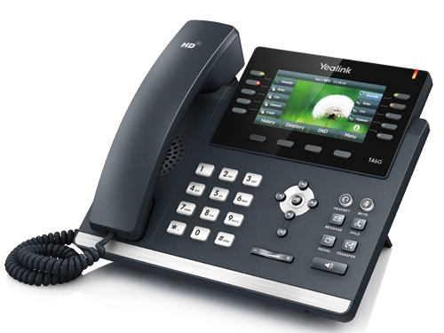

# Yealink T46S

Here you can find the languagefiles for the Yealink T46S.  
Although this phone is EOL, it is still used a lot. The following language numbering is used:

000\. English  
001\. Chinese S  
002\. Chinese T  
003\. French CA  
004\. French  
005\. German  
006\. Italian  
007\. Polish  
008\. Portugese  
009\. Portugese LA  
010\. Spanish  
011\. Spanish LA  
012\. Turkish  
013\. Russian  
014\. Czech  
015\. Hebrew  
016\. Arabic  
017\. Dutch

Languages officially maintained by Yealink cannot be found on this page. You can find these languagefiles at: https://support.yealink.com/en/portal/docList?archiveType=resource&productCode=95ef8c9dce7c98ba
